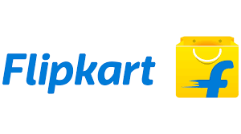

# 🌟 Web Showcase of Following:
- 🖼️ Image Gallery  
- 📝 Registration Form  
- 💼 LinkedIn Post Clone

Welcome to this simple and elegant **HTML-CSS-based** minor web development project. It showcases foundational frontend skills through the following key components:

1. 🖼️ A categorized **Image Gallery**
2. 📝 A detailed **Student Registration Form**
3. 💼 A professional **LinkedIn Post UI Clone**

---

## 📌 Project Highlights

### 1️⃣ Image Gallery

An organized, responsive table displaying categorized logos of:

- 🛒 Popular Shopping Websites
- 💼 Top IT Companies
- 💻 DSA Practice Platforms

The gallery consists of three main categories:

| 🛒 Shopping Websites | 💼 Top IT Companies | 💻 DSA Practice Platforms |
|---------------------|--------------------|---------------------------|
|  Flipkart |  Google |  LeetCode |
|  Amazon |  Amazon |  Codeforces |
|  Myntra |  Microsoft |  InterviewBit |
|  Ajio |  IBM |  HackerRank |

---
> 📁 The gallery is built using pure HTML and CSS.

---

### 2️⃣ Student Registration Form

📄 A comprehensive and user-friendly registration form titled:

## ✨ *"Student Onboarding Form"*

### Form Features:

- Input fields for **Name**, **Gender**, **DOB**, **Contact**, **Address**
- Dropdowns for selecting **Batch**, **Subjects of Interest**, **Languages**, **State**, and **Country**
- Form controls like **radio buttons**, **checkboxes**, and **date picker**
- Styled using external CSS (`Registration_form.css`)

> The form is accessible, structured in a clean table format, and designed for beginner-level web form understanding.

---

### 3️⃣ LinkedIn Profile Post Clone

📢 **"Motivational LinkedIn Post UI – Inspired by Real Success Stories"**

This section is a visually accurate clone of a professional LinkedIn post layout. It showcases:

- 👤 A profile section with photo, name, and tagline
- 📝 A motivational post paragraph sharing a real journey (B.Tech to Google)
- 🖼️ An image section featuring a corporate workplace
- 🔁 Social reaction icons like Like, Comment, Repost, Send
- 💬 Clean action buttons for interactivity

> Styled using an external stylesheet (`index.css`), this component demonstrates modern HTML structure and responsive UI capability.

---

## 🗂️ Project Structure

```plaintext
Images-Gallery/
│
├── index.html                  # Image Gallery page
├── style.css                   # CSS for the gallery
│
├── registration_form.html      # Student registration form
├── Registration_form.css       # CSS for the form
│
├── linkedin/
│   ├── linkedin_post.html      # LinkedIn style post page
│   ├── index.css               # CSS for LinkedIn post
│   ├── Profile.jpg             # Profile picture
│   └── Google_India.jpg        # Post image
│
├── images/                     # Logos used in the gallery
│   ├── FlipkartLogo.png
│   ├── AmazonShoppingLogo.jpeg
│   ├── MyntraLogo.png
│   ├── AjioLogo.jpeg
│   ├── Google.png
│   ├── AmazonLogo.jpeg
│   ├── MicrosoftLogo.png
│   ├── IBMLogo.png
│   ├── LeetCode_logo.png
│   ├── codeforces_logo.png
│   ├── InterviewBit.png
│   ├── HackerRank_Logo.png
│
└── README.md                   # Project documentation
